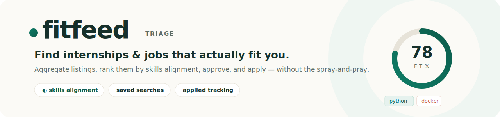
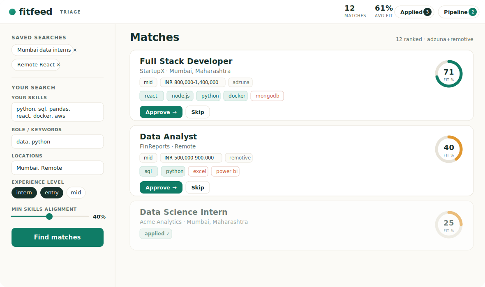

<p align="center">
  
</p>

<p align="center">
  
  
  
  
</p>

<h1 align="center">fitfeed</h1>

<p align="center">
  A local job &amp; internship hunter that aggregates listings, ranks them by how well they
  <strong>fit your skills</strong>, and lets you review, approve, and apply — one click at a time.
</p>

---

## Why

Job boards bury the roles you'd actually be good at under hundreds you wouldn't. Mass auto-apply
bots get your accounts banned and produce throwaway applications. **fitfeed** takes the middle path:
it pulls real listings, scores each one against *your* skills so the best-fit jobs rise to the top,
and keeps a human in the loop for the final apply — so your accounts stay safe and your applications
stay deliberate.

<p align="center">
  
</p>

> The image above is a rendering of the interface. To drop in a real screenshot, run the app,
> capture the window, and save it as `docs/screenshot.png`, then point the line above at it.

## Features

- **Skills-alignment scoring** — every listing gets a 0–100 fit score based on how many of *its*
  required skills you cover, with the matched and missing skills shown right on the card. The
  ranking is explainable, not a black box.
- **Filters that matter** — role/keywords, location (incl. remote), salary floor, experience level
  (intern / entry / mid / senior), and a minimum-alignment threshold.
- **Review &amp; approve** — a fast triage flow; approved jobs collect in a pipeline drawer.
- **Human-in-the-loop apply** — open approved jobs in your own logged-in browser session and click
  apply yourself. No ToS-violating mass submission, no ban risk.
- **Applied tracking** — jobs you apply to are logged and stop resurfacing in future searches.
  Review them in the Applied tab; unmark any time.
- **Saved searches** — save a filter set and re-run it in one click. Persisted locally across runs.
- **Pluggable sources** — ships with Adzuna (free API, India + global) and Remotive (remote roles).
  Add a new board by writing one small class.

## Quickstart

```bash
# 1. install
python -m venv .venv
source .venv/bin/activate          # Windows: .venv\Scripts\activate
pip install -r requirements.txt

# 2. configure (optional — runs on sample data without this)
cp config.example.yaml config.yaml # Windows: copy config.example.yaml config.yaml
#    then edit config.yaml: your skills, filters, and free Adzuna API keys

# 3. run
python server.py                   # opens http://127.0.0.1:5050
```

Want to see the interface without installing anything? Open **`webui/preview.html`** in any browser.

Free Adzuna API keys take a minute to get at <https://developer.adzuna.com/>. Without them the app
uses built-in sample data and Remotive's free (no-key) remote-jobs feed.

### Assisted apply (optional)

To open approved jobs in a persistent, logged-in browser:

```bash
pip install playwright
playwright install chromium
```

You log in once; the session is remembered for next time. fitfeed never submits an application for
you — you make the final click.

## Command line

The same pipeline runs in the terminal if you prefer it:

```bash
python -m jobhunter.main --mock --no-apply   # try it with sample data
python -m jobhunter.main                      # live run using config.yaml
```

## How it works

```
sources  ──►  matching  ──►  review  ──►  apply
(adzuna,      (skill        (web UI or    (your own
 remotive,     detection +   CLI; you      logged-in
 …)            alignment     approve)      browser)
               scoring +
               filtering)
```

Applied history and saved searches persist to `~/.jobhunter/state.json`.

## Project layout

```
jobhunter/
├─ server.py              Flask app — serves the dashboard + API
├─ webui/
│  ├─ index.html          the dashboard (served by the app)
│  └─ preview.html        standalone demo, no server needed
├─ jobhunter/
│  ├─ models.py           Job / UserProfile / Filters
│  ├─ matching.py         skill detection, alignment scoring, ranking
│  ├─ store.py            applied-history + saved-search persistence
│  ├─ review.py           CLI approval flow
│  ├─ apply.py            human-in-the-loop assisted apply
│  ├─ main.py             CLI entry point
│  └─ sources/            adzuna · remotive · mock · (add your own)
├─ config.example.yaml    copy to config.yaml and edit
└─ requirements.txt
```

## Add a job source

Subclass `JobSource`, implement `fetch()` to return `Job` objects, and register it in
`build_sources()`. The matching, review, and apply stages pick it up automatically.

## A note on Naukri / LinkedIn / Internshala

Bot-scraping and auto-submitting applications to these sites violates their Terms of Service and gets
accounts banned. fitfeed deliberately avoids that: it surfaces comparable listings legally via Adzuna
for the browse/rank step, and for the apply step it opens jobs in *your* real session so you stay in
control. Extend at your own discretion.

## License

[MIT](LICENSE) © Your Name
